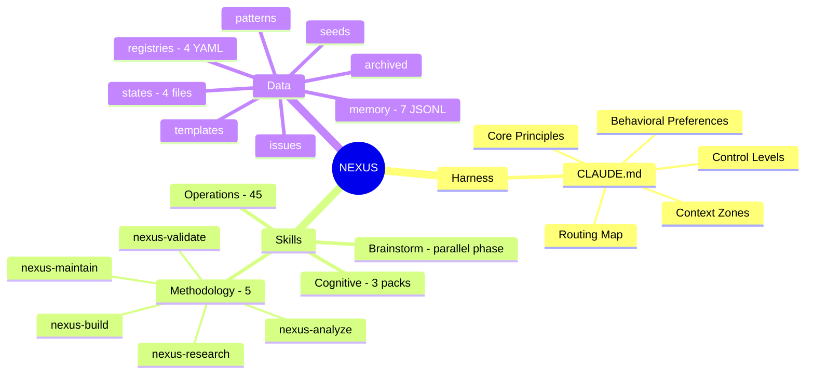
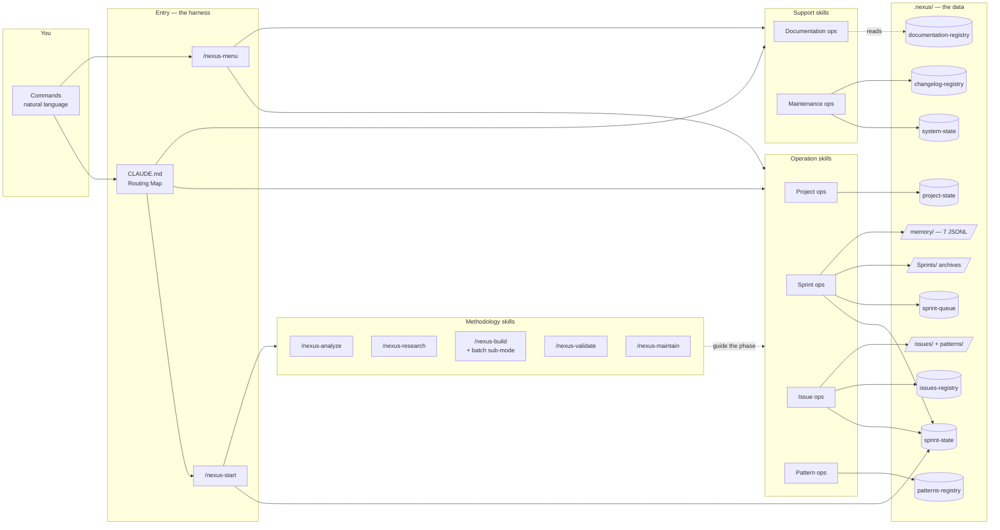
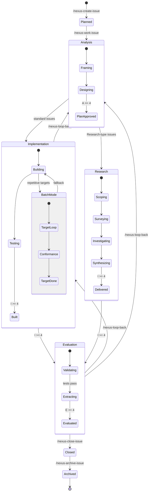
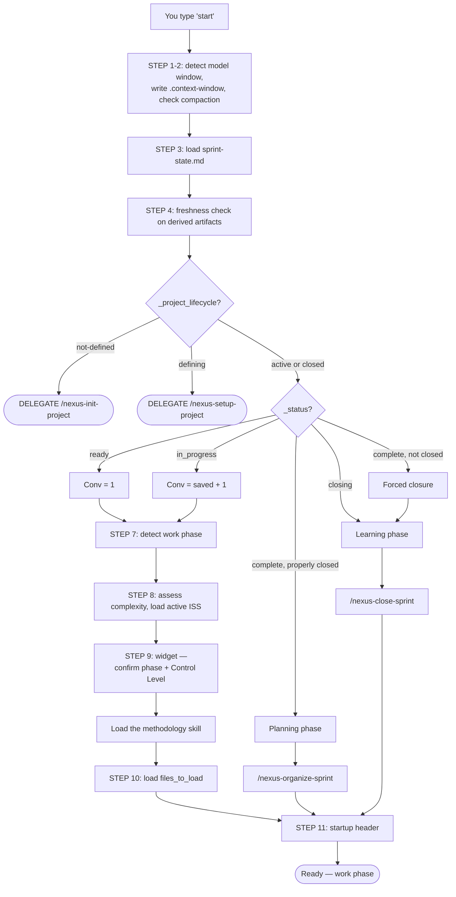

# NEXUS Architecture — Visual Quick Guide
*Version: 2.0.2 | Date: 2026-08-25 | Sprint: 110*

**Source files**:
- `CLAUDE.md` v5.16.0 (System Nature, Routing Map, Phase-Management-Protocol)
- `.claude/skills/nexus-start/SKILL.md` v2.9.2 (boot sequence)
- `.nexus/active/NEXUS-Architecture.md` v4.1.0 (system relationship map)
- `.nexus/human-guides/nexus-framework-guide.md` v2.3.1 (the prose these diagrams illustrate)

> **Purpose**: see the shape of NEXUS in four diagrams (~5 minutes). This guide *shows*;
> [nexus-framework-guide.md](nexus-framework-guide.md) *explains*. For the architecture, the context
> zones, and the Control Levels consent model in prose, read
> [The Three Unbreakable Principles](nexus-framework-guide.md#the-three-unbreakable-principles) and
> [System Architecture](nexus-framework-guide.md#system-architecture) — this guide does not restate them.

---

## 1. The Shape of the System

NEXUS has three moving parts: a **harness** that is always loaded, **skills** that load on demand, and
**data** that everything reads and writes. Work flows through a fixed chain — Project → Sprints → Issues
(analyze → implement → evaluate) → Patterns → Evolution.

**Counts verified on disk**: 54 skill folders under `.claude/skills/nexus-*/`, 4 state files, 4 registries,
7 memory files, 52 active patterns. `/nexus-build` additionally carries a **batch sub-mode** for repetitive
targets — it is a mode of Build, not a sixth methodology.

---

## 2. How the Layers Interact

Commands enter through the routing map in `CLAUDE.md`, skills do the work, and everything durable lands in
`.nexus/`. Nothing is hidden: each box below is a file or a folder you can open in a text editor.

**The two files everything depends on**: `sprint-state.md` is the continuity lifeline — loaded every
conversation, and the reason a new conversation can pick up exactly where the last one stopped.
`issues-registry.yaml` is the single source of truth for issue phase scores.

**Two-place update rule**: an issue's phase scores are written to **both** `issues-registry.yaml` (source of
truth) and `sprint-state.md` `[OBJECTIVES]`. Updating only one is a protocol violation.

---

## 3. The Issue Lifecycle

Every piece of work follows the same path. Each phase has a methodology skill that guides it, and a phase
transition happens when that phase's score reaches ≥ 4/5 **and you approve it**. Research-type issues follow
A → R → E instead of A → I → E.

**Phase → skill**: Analysis → `/nexus-analyze` · Research → `/nexus-research` · Implementation →
`/nexus-build` (batch sub-mode included) · Evaluation → `/nexus-validate`. `/nexus-brainstorm` sits
**outside** this lifecycle as a parallel phase — you can enter it from any phase and exit to any phase.

**Sprints** wrap issues in three kinds of conversation: **Planning** (`/nexus-organize-sprint` creates the
sprint and selects issues), **Work** (issues move through their phases), and **Learning**
(`/nexus-close-sprint` extracts patterns, indexes the memory layer, updates project state).

---

## 4. The Boot Sequence

Every conversation starts here. You type "start"; `/nexus-start` detects where you left off, asks you to
confirm the phase and the session's Control Level, then loads exactly what that phase needs.

The widget at STEP 9 is the safety net: if the detected phase is wrong, you override it there, and nothing
loads until you have answered. Control Level is asked every conversation and is **not** remembered from the
last one.

---

## 5. Where to Go Deeper

| Resource | What You'll Find | Location |
|----------|-----------------|----------|
| **[NEXUS Framework Guide](nexus-framework-guide.md)** | The complete prose reference — principles, Control Levels, context zones, architecture, methodologies, cognitive tools, health system | `.nexus/human-guides/nexus-framework-guide.md` |
| **NEXUS-Architecture.md** | The full system relationship map — every skill, every file it reads and writes | `.nexus/active/NEXUS-Architecture.md` |
| **CLAUDE.md** | The harness itself — protocols, routing map, preferences, principles. Readable end to end | `CLAUDE.md` |
| **The skills** | What each operation actually does, step by step | `.claude/skills/nexus-*/SKILL.md` |
